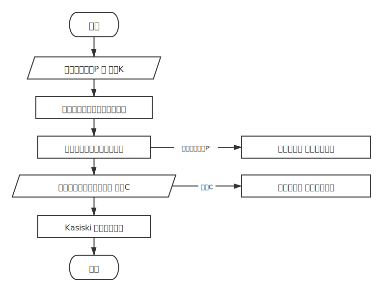
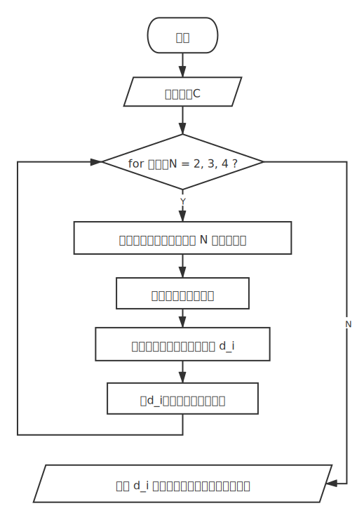
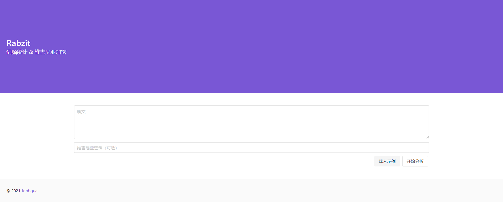
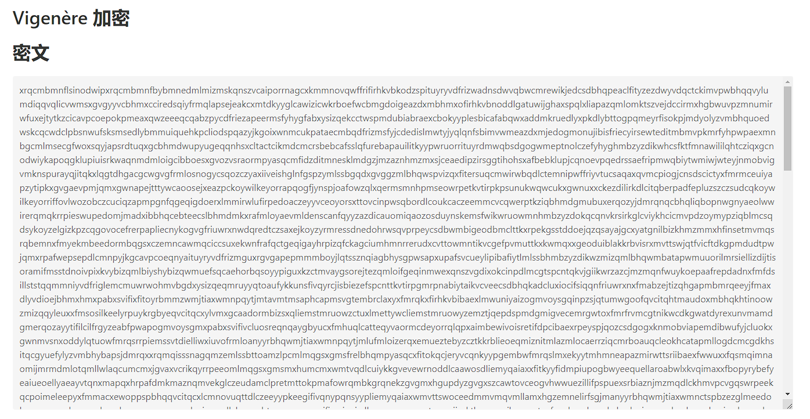
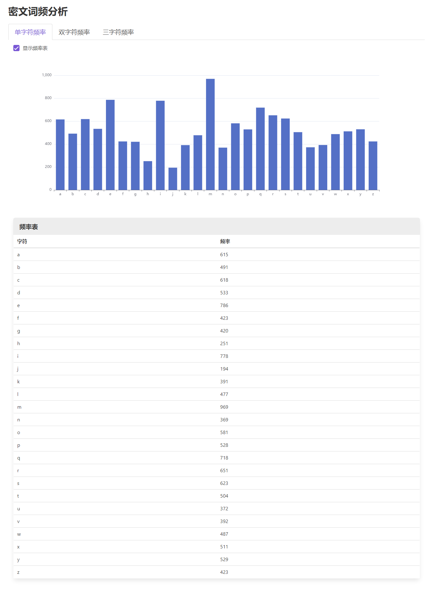
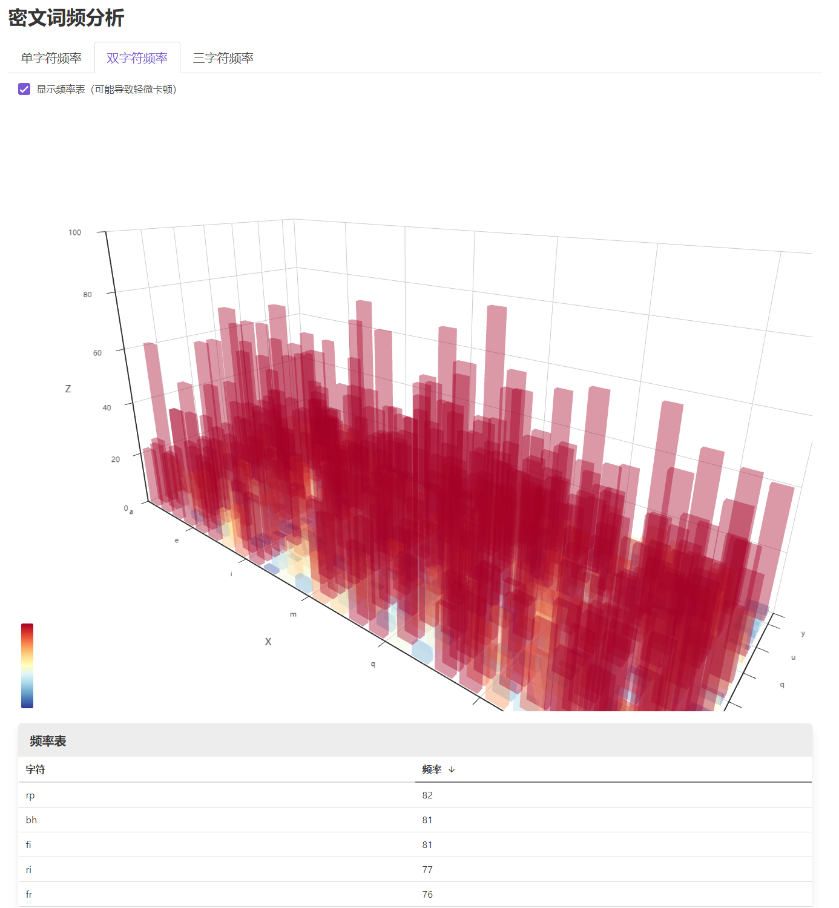
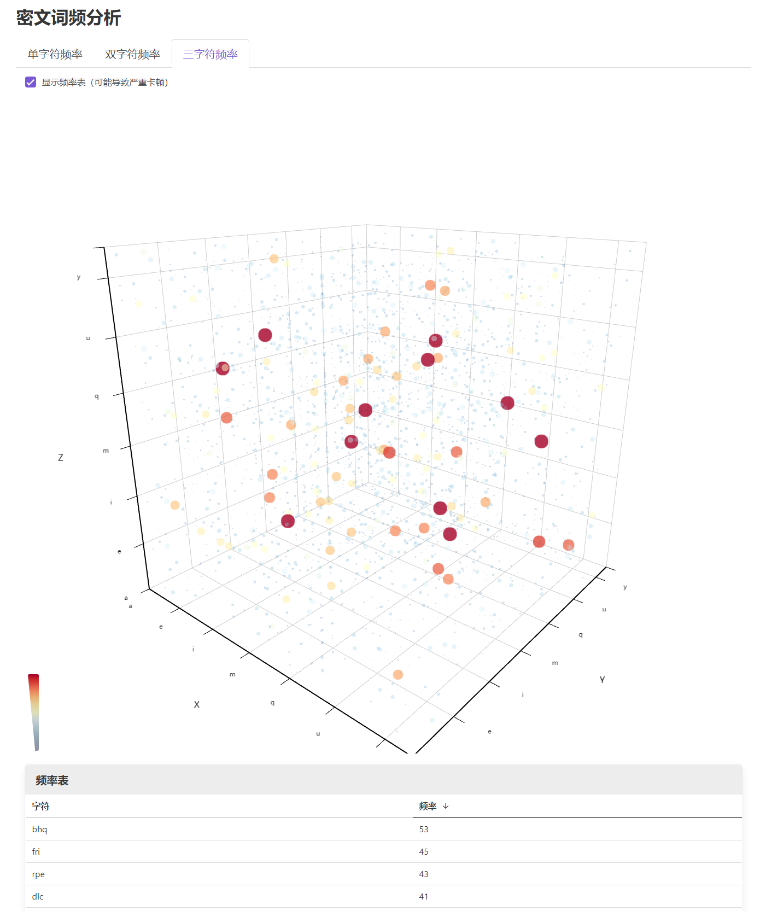

# Rabzit

[Rabzit](https://rabzit.jonbgua.com) 是一个维吉尼亚密码加密器，系《密码学导论》课程的大作业之一。

一些技术经验总结可参见 [手记：开发 Rabzit 过程中的经验总结 | 酱瓜](https://jonbgua.com/developing-rabzit.html)。

## 流程图

### 主程序

### Kasiski 分析

## 效果预览

### 主界面

### Vigenère 加密

下例中用到的的明文和密钥可点击网页上的「载入示例」获取并复现加密结果。

#### 密文

#### 统计分析

##### 单字符频率统计

##### 双字符频率分析

##### 三字符频率分析

